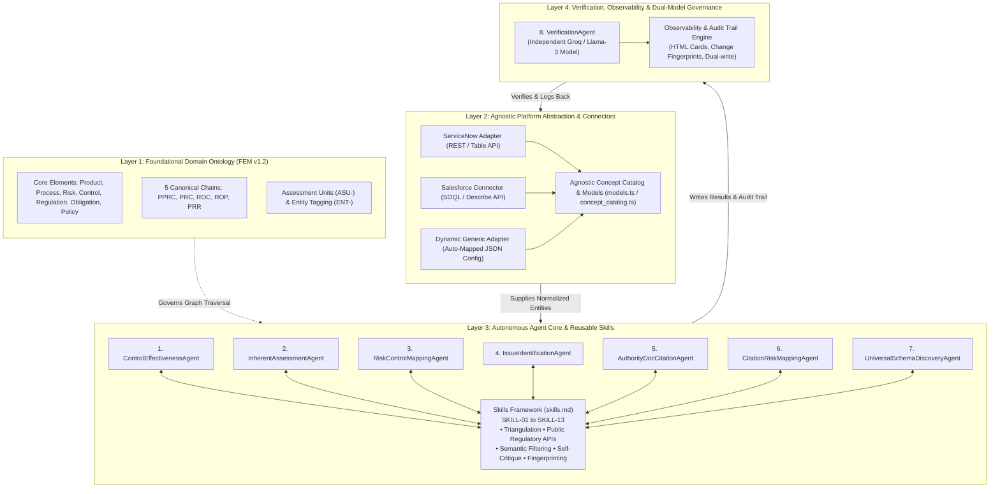

# Enterprise GRC Autonomous Multi-Agent Architecture (`ARCHITECTURE.md`)

This document provides the comprehensive system architecture, domain ontology, agent execution framework, and verification engine for the Autonomous GRC Platform.

---

## 🏛️ 1. Foundational Domain Model: Wissda Foundational Element Model (FEM v1.2)

The architecture is strictly grounded on the **Wissda Foundational Element Model (FEM v1.2)**. All agents, connectors, and discovery mechanisms adhere to this domain topology:

```text
                  PRODUCT
                     |
                     | delivered_by (FEM-C-016)
                     v
REGULATION        PROCESS
    |                |
    | decomposes_to  | exposed_to
    v                v
OBLIGATION --raises-> RISK <--- governs --- POLICY (FEM-C-003)
    |                |    |
    | addressed_by   |    +---- implemented_by (optional) ----+
    |                v                                        |
    +-----------> CONTROL <-----------------------------------+
```

### The Five Canonical Traversal Chains
1. **`PPRC`**: `product → process → risk → control` (*The only route from a product to a control*).
2. **`PRC`**: `process → risk → control` (*The only route from a process to a control*).
3. **`ROC`**: `regulation → obligation → control` (*Regulatory coverage operationalization*).
4. **`ROP`**: `regulation → obligation → policy` (*Policy coverage and alignment*).
5. **`PRR`**: `policy → risk (+ optional policy → control)` (*Policy risk position*).

### Forbidden Direct Edges (Schema Invariants)
- ❌ Direct `process → control` is forbidden (coverage is always derived through `process → risk → control`).
- ❌ Direct `regulation → control`, `regulation → policy`, `regulation → risk` are forbidden (must traverse through `obligation`).
- ❌ Direct `product → control`, `product → risk` are forbidden (`Product` is a scoping entity reaching controls only through `delivered_by → process`).
- ❌ `Risk` must be scored inside an `Assessment Unit` (`ASU-`), not as an ungrounded flat field.

---

## 🏗️ 2. Four-Tier System Architecture



---

## 🤖 3. Agent Registry & Skill Mapping

All agents are governed by [agents.md](file:///c:/Users/Sanela%20Srujan/Downloads/Kowshik%20agent/agents.md) and powered by modular capabilities in [skills.md](file:///c:/Users/Sanela%20Srujan/Downloads/Kowshik%20agent/skills.md):

| # | Agent Class | Primary Purpose | Skills Utilized | Output Target |
|---|-------------|-----------------|-----------------|---------------|
| **1** | `ControlEffectivenessAgent` | Operating effectiveness assessment from tests and open issues | `SKILL-01`, `SKILL-05`, `SKILL-06`, `SKILL-12` | `sn_risk_advanced_risk_assessment_instance_response`, `u_rationale_auditing_purpose` |
| **2** | `InherentAssessmentAgent` | 4-factor risk scoring (Financial, Regulatory, Customer Conduct, Reputational) | `SKILL-02`, `SKILL-03`, `SKILL-04`, `SKILL-05`, `SKILL-06`, `SKILL-12` | `inherent_justification`, `u_rationale_auditing_purpose` |
| **3** | `RiskControlMappingAgent` | Semantic gap analysis & control recommendations | `SKILL-07`, `SKILL-05`, `SKILL-12` | `m2m_risk_control`, `u_ai_recommendation` |
| **4** | `IssueIdentificationAgent` | Audit finding clustering & root-cause analysis | `SKILL-04`, `SKILL-07`, `SKILL-12` | `sn_grc_issue`, `u_issue_summarize_ema` |
| **5** | `AuthorityDocCitationAgent` | Regulatory decomposition into atomic single-duties | `SKILL-08`, `SKILL-05`, `SKILL-12` | `sn_compliance_citation` |
| **6** | `CitationRiskMappingAgent` | Citation-to-risk matching with first-class gap handling | `SKILL-09`, `SKILL-07`, `SKILL-12` | `sn_risk_risk`, `m2m_citation_risk` |
| **7** | `UniversalSchemaDiscoveryAgent` | Introspection, vector matching, and adapter config generation | `SKILL-10`, `SKILL-13`, `SKILL-04` | `GeneratedAdapterConfig` JSON file |
| **8** | `VerificationAgent` | Independent second-pass cross-validation & hard-veto | `SKILL-11`, `SKILL-01`, `SKILL-12` | `u_verification_layer_output` |

---

## 🔒 4. Governance, Reliability & Observability Principles

1. **"The Producer Never Grades Its Own Work"**:
   - Producer passes run on Gemini (Google infrastructure).
   - The `VerificationAgent` runs independently on Groq (Llama-3).
   - Raw evidence is re-pulled fresh from the database rather than trusting producer justifications.
2. **Resilience by Construction**:
   - Per-item `try/catch` wrapping prevents a single failed record from aborting batch assessments.
   - Dual-attempt verified writes protect against platform silent drops.
   - Deterministic fingerprinting prevents redundant LLM re-assessments when data is unchanged.
3. **Audit Trail Transparency**:
   - Rich-text HTML audit cards render directly into platform UI (`u_rationale_auditing_purpose`, `u_ema_audit_trail`), capturing step-by-step tool invocation logs, timing, and confidence indicators.
